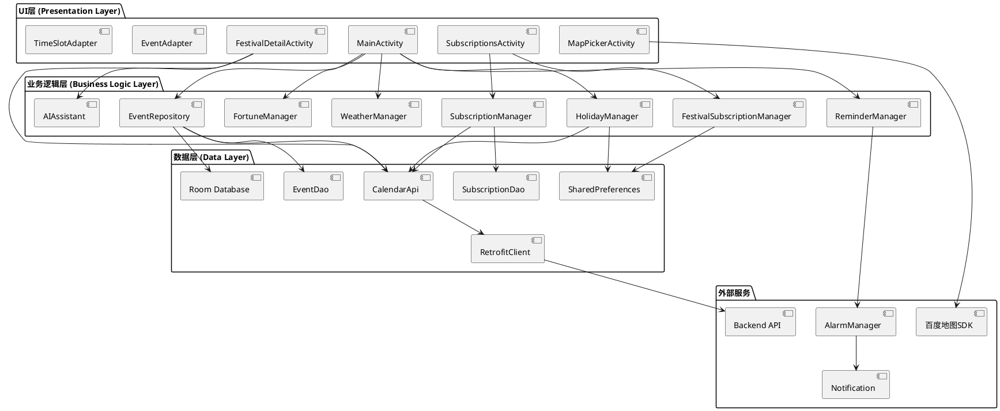
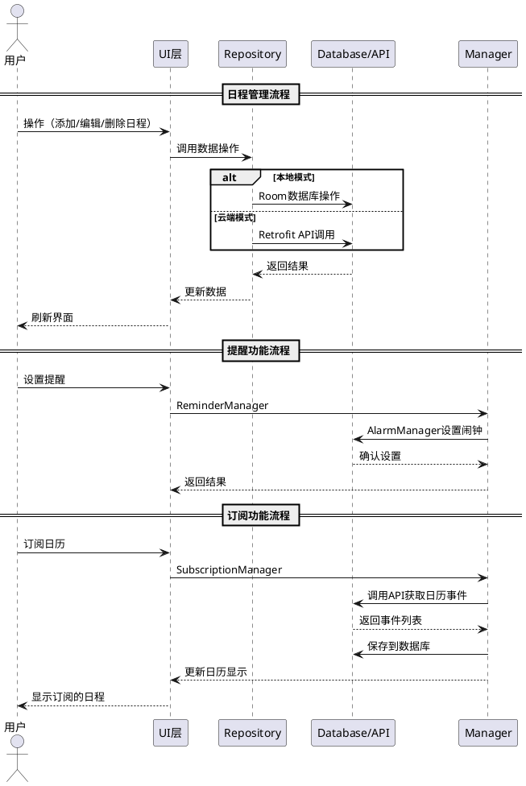
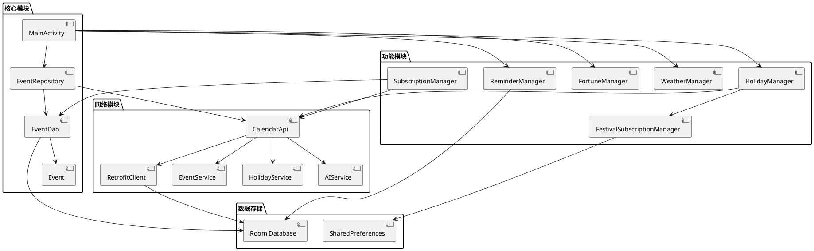
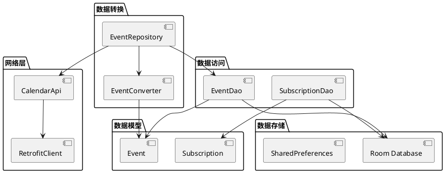
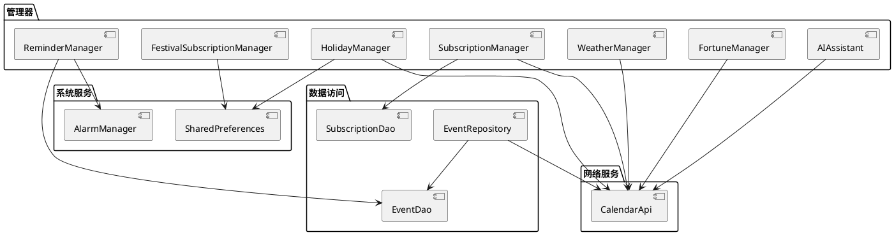
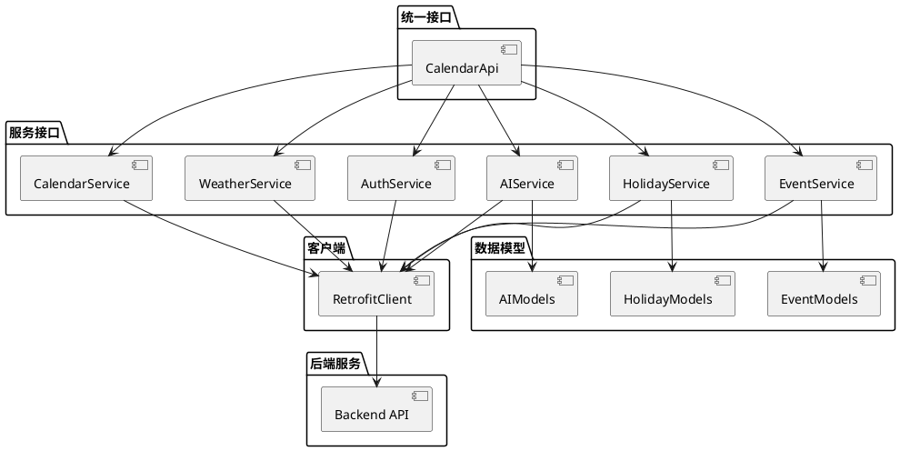
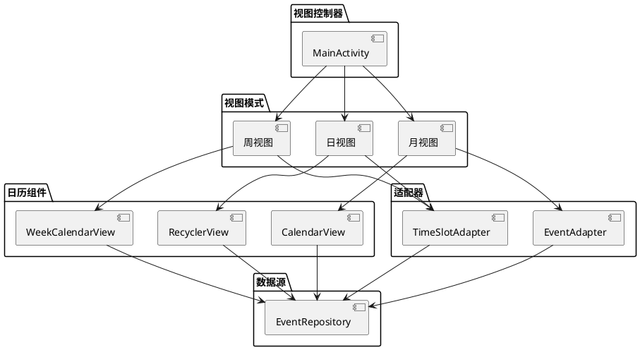

# ③ 软件架构图

## 3.1 系统整体架构图



---

## 3.2 数据流架构图



---

## 3.3 模块依赖关系图



---

## 3.4 UI层架构图

```plantuml
@startuml UI层架构图

package "Activity" {
    [MainActivity] as Main
    [SubscriptionsActivity] as Sub
    [FestivalDetailActivity] as Festival
    [MapPickerActivity] as Map
}

package "Adapter" {
    [EventAdapter] as EventAdapter
    [TimeSlotAdapter] as TimeSlotAdapter
    [SubscriptionAdapter] as SubAdapter
    [FestivalSubscriptionAdapter] as FestivalAdapter
}

package "Dialog" {
    [EventEditDialogHelper] as Dialog
}

package "View" {
    [CalendarView] as CalendarView
    [WeekCalendarView] as WeekView
    [RecyclerView] as RecyclerView
}

Main --> CalendarView
Main --> WeekView
Main --> RecyclerView
Main --> EventAdapter
Main --> TimeSlotAdapter
Main --> Dialog

Sub --> SubAdapter
Sub --> FestivalAdapter

Festival --> RecyclerView

Map --> RecyclerView

EventAdapter --> Main
TimeSlotAdapter --> Main
SubAdapter --> Sub
FestivalAdapter --> Sub

Dialog --> Main

@enduml
```

---

## 3.5 数据层架构图



---

## 3.6 业务逻辑层架构图



---

## 3.7 网络层架构图



---

## 3.8 视图模式架构图



---

## 使用说明

以上架构图使用 **PlantUML** 格式编写。

### 如何生成图片

1. **在线工具**：
   - 访问 http://www.plantuml.com/plantuml/uml/
   - 复制对应的PlantUML代码
   - 生成图片并下载

2. **VS Code插件**：
   - 安装 "PlantUML" 插件
   - 打开对应的 `.puml` 文件
   - 使用快捷键生成图片

3. **本地工具**：
   - 安装 PlantUML Java 运行时
   - 使用命令行生成图片：
     ```bash
     plantuml ③软件架构图.md
     ```

### 图片替换

生成图片后，可以：
1. 将生成的图片保存到 `adapp/产品报告/` 目录
2. 在文档中引用图片：
   ```markdown
   
   ```
3. 或者保留PlantUML代码，支持在线查看

---

## 架构说明

### 3.1 系统整体架构
展示了UI层、业务逻辑层、数据层和外部服务之间的关系。

### 3.2 数据流架构
展示了数据在各个层次之间的流动过程。

### 3.3 模块依赖关系
展示了各个模块之间的依赖关系。

### 3.4 UI层架构
展示了UI组件的层次结构。

### 3.5 数据层架构
展示了数据存储和访问的架构。

### 3.6 业务逻辑层架构
展示了业务逻辑管理器的架构。

### 3.7 网络层架构
展示了网络服务的架构。

### 3.8 视图模式架构
展示了三种视图模式的架构。

